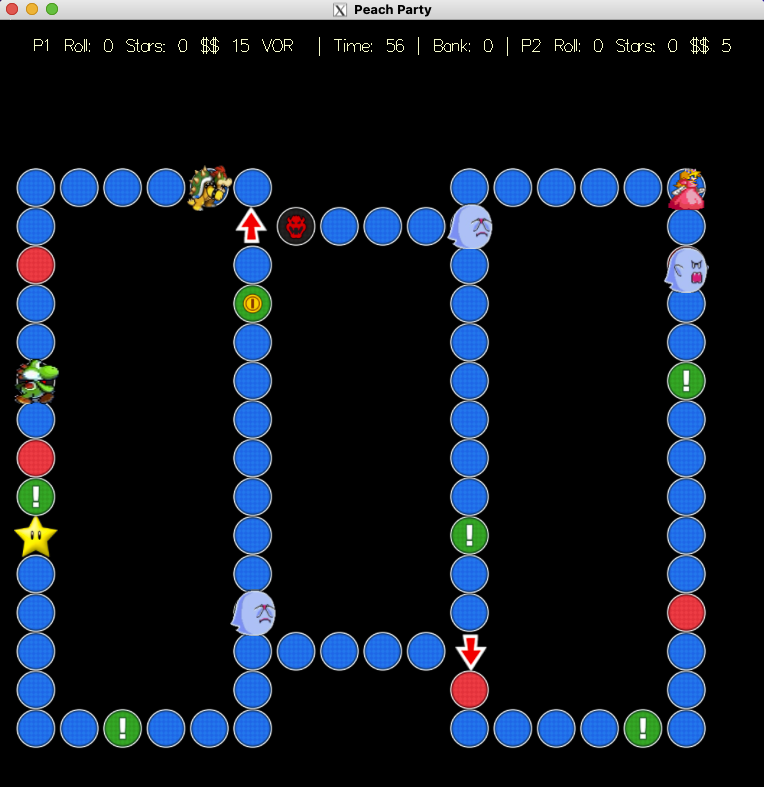

# PeachParty
#### A Multiplayer Mario Peach & Bowser Game 

## About this Project
Project created using C++ as part of UCLA's CS 32 Course for experience with Data Structures and OOP principles.

#### Video Demo: 

## Playing Game
- Run `main.cpp` to start game
- Press key `1`-`9` to choose board
- Peach player rolls with `Tab` and moves with `WASD`
- Yoshi player rolls with `Enter` and moves with `Arrow keys`
- Winner is whichever player has more money at the end

